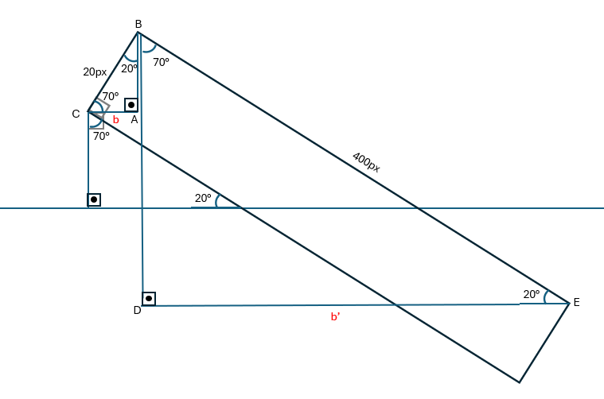

# Seesaw Animation

A simple, interactive seesaw animation developed with pure JavaScript, HTML and CSS.

## Contents:

1. [Project Overview](#project-overview)
2. [Thought and Design Process](#thought-and-design-process)
3. [Physique Calculations](#physique-calculations)
4. [Geometry Calculations](#geometry-calculations)
5. [Folder Structure](#folder-structure)
6. [Trade-offs and Limitations](#trade-offs-and-limitations)
7. [AI Assistance](#ai-assistance)
8. [How to Run the Project](#how-to-run-the-project)
9. [Possible Future Improvements](#possible-future-improvements)

## Project Overview

This project is a visual seesaw simulation in pure JavaScript where random-weight objects can be dropped by clicking directly on the seesaw.

Each click adds a new object with a random weight (1–10 kg) at the clicked position,
and the seesaw tilts based on real physics logic.

Total weights on each side of the seesaw and the calculated angle of the tilt is shown above the seesaw.

Current state of the seesaw is stored in the local storage, ensuring that the progression is saved even after a page refresh. Seesaw state can be reset by the reset button below the seesaw.

The implementation focuses on clean architecture, DOM manipulation, and maintaining smooth animations.

## Thought and Design Process

### 1. Main Process:

My initial goal was to simulate the seesaw's tilt with the correct angle whenever the seesaw is clicked. Therefore, I started with generating a random weight between 1-10 kg, calculating the direction of the point clicked and the distance between that and the pivot point. Afterwards, I used necessary [physique calculations](#physique-calculations) to find the correct angle. I rotated the plank of the seesaw with the calculated angle.

Next, I restructured the code for a cleaner architecture. I split the code to managable, reusable pieces to ensure separation of concerns with the use of modules. I also provided more security by avoiding the usage of global variables by implementing closures.

Having formed a clear structure, I proceeded with the remaining weight animations. I added a weight indicator right above the seesaw that moves whenever a user hovers over around the seesaw.

I used simple [geometry calculations](#geometry-calculations) to find the new boundaries of the plank whenever it is rotated to modify the clickable space around the seesaw as accurate as possible.

Finally, I added the necessary animations for logging the created weights.

### 2. State Management:

I used local storage to persist the current state so the user’s progress wouldn't reset on page reload. I stored and updated the statistics values separately whenever a weight is created and stored the created weights in a weight list for easy destructuring on initialization.

Weight list form:

    {
        left: [[weight, position from left, distance]],
        right: [[weight, position from left, distance]],
    };

I used `getBoundingClientRect()` to place the weights on the plank at the position a user clicks. However, on the first time the application starts, the boundary method returned incorrect results, returned correctly when the page was refreshed. As a workaround for this problem, I stored the correct positions directly to eliminate the usage of the bounding rectangle method on initialization.

### 3. UI and Animation:

The UI of the clickable space around the seesaw should have been updated whenever the seesaw rotates since the clickable space should be restricted to the top face of the plank.
I used `getBoundingClientRect()` method to find the boundaries of the plank. I updated the found boundaries with the horizontal distance of top and bottom corners and the horizontal shift a corner does when it rotates, on each side. The width of the clickable space is recalculated whenever the plank rotates.

The weights should be stucked on the plank element to be tilted whenever the plank rotates. On the other hand, the falling animation of the weights should be independent of the rotation of the plank to fall on a straight vertical axis. As a solution, I have created a stationary element that is not affected by the plank's rotation. I have appended the created weights to this element until their falling animation is completed. Once the animation is finished, I removed them from the stationary element and appended them to an element that is affected by the plank's rotation.

## Physique Calculations

I used respective formulas to calculate the torque on each side and the angle.

    torque = sum(weight × distance)

    const angle = Math.max(-30, Math.min(30, (rightTorque - leftTorque) / 10));

## Geometry Calculations

I used simple [geometry calculations](#geometry-calculations) to find the new boundaries of the plank whenever it is rotated to modify the clickable space around the seesaw as accurate as possible.

### Law of Sines:

$$
\frac{a}{\sin(A)} = \frac{b}{\sin(B)} = \frac{c}{\sin(C)}
$$

Where:

a, b, c = side lengths

A, B, C = angles opposite to those sides

$$
b = \frac{b}{\sin(A)}{*sin(B)}
$$

By using Law of Sinus theorem, we can find the horizontal distance between the bottom and the top corners and the horizontal distance between the top corners of the rotated plank.

If the plank is tilted to the right, the clickable space shifts from the most left point of the plank to the right by `b` and if it tilts to left it does not shift. The width of the clickable space is always equal to `b'`.

### Implementation:

    const newLeft = plank.getBoundingClientRect().left;

    const b = plankHeight * Math.sin((Math.abs(State.angle) * Math.PI) / 180);

    let newWidth = 0;

    const rad = 90 - Math.abs(State.angle);

    if (State.angle > 0) {

      newWidth = plankWidth * Math.sin((rad * Math.PI) / 180);

      weightIndicatorContainer.style.left = `${b / 2}px`;

    } else if (State.angle < 0) {

      newWidth = plankWidth * Math.sin((rad * Math.PI) / 180);

      weightIndicatorContainer.style.left = `${-b / 2}px`;

    }

`Math.sin()` function takes radiant, so the angle is converted into radiant from degree. Division by 2 is applied since the element wasa positioned relative to the plank's center.

## Folder Structure

    /assets
        hard-object-drop-98768.mp3
    /css
        styles.css
    /js
        /dom
            logs.js
            seesaw.js
            stats.js
    app.js
    physics.js
    state.js
    index.html
    README.md

### 1. Assets:

The `Hard object Drop` sound from `freesound_community` is downloaded from: https://pixabay.com/sound-effects/search/object-falls/

### 2. CSS:

<strong> styles.css </strong> file contains all of the css classes.

### 3. Js:

- #### DOM:

  This folder contains all of the files related to DOM updates.

  - <strong> logs.js </strong>:
    adding and resetting logs

  - <strong> seesaw.js </strong>:
    calculating the center, rotating the plank, weight creation, weight indicator's UI updates, playing the sound effect functionalities, initializing the weight and the log elements according to the weight list and resetting them

  - <strong> stats.js </strong>:
    updating and resseting the statistics above the seesaw

- <strong> app.js </strong>:
  main script containing app initialization and event listeners for mouse interactions

- <strong> physics.js </strong>:
  torque and angle calculations

- <strong> state.js </strong>:
  storing to and resetting from the local storage of weight, torque and angle values

- <strong> index.html </strong>:
  main entry point of the application

## Trade-offs and Limitations

### Related to Plank Rotation:

The rotation of the plank caused incorrect boundary calculations of the clickable space, I have applied customized math to commpensate this problem as much as possible.

Plank's rotation also affected the weight's transformations and caused the weights to fallin a non straight manner when the plank was rotated. I used a stationary container as a parent of a weight until the falling animation is completed and used the rotated plank's space as a parent later. This re-parenting caused a small jump in the animation.

### CSS Loading Latency

At some point of the development process, I realized the positions calculations done by CSS were incorrect when the application is opened for the first time. These problems would disappear when the page is refreshed. After some research, I concluded that it was caused by not being able to load css soon enough. I have used `DOMContentLoaded` and window element's `load` events for creating event listeners to fix the latency issues related to CSS.

## AI Assistance

Assistance of AI was used when:

- description of CSS `transform` property
- function description of `getBoundingClientRect()`
- generating random colors for weights
- generating the <strong> Law of Sines </strong> formula
- search about naming conventions for proper naming of the files
- structuring the <strong> README.md </strong> file, not the content itself

## How to Run the Project

- from GitHub:
  - clone the project
  - open `index.html` with Live Server
- from GitHub Pages:
  https://csvrn.github.io/Seesaw_Animation_Ece_Savran/

## Possible Future Improvements

- smoother animations
- a horizontal, dashed line indicator to show the distance between the weight indicator and the pivot
- drag-drop functionality for weights
- sound toggle
